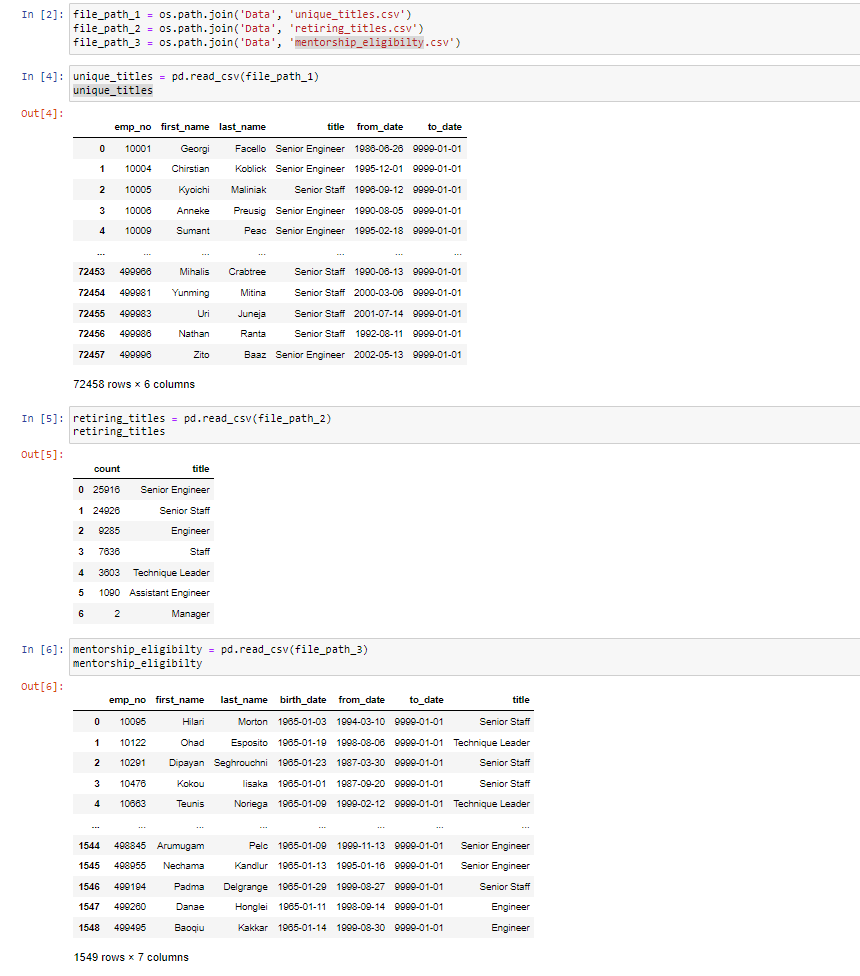

# SQL-Employee-Analysis

## Overview
The large company, Pewlett Hackard, has assigned two tasks: 
- To determine the number of retiring employees per job title
- To identify employees eligible to participate in mentorship programs

<u> I will be using postgreSQL to navigate through multiple databases in order to create various relationships which will help analyze the information we have on the company. The resulting analysis will help come to a conclusion on the two tasks <u/>

## Results
In this section, ill be going over four major points dervied from query built tables that show the relations between multiple databases. These major point wills help Pewlett-Hackard management with the tasks revolving their retiring employees
  
- Looking at the "retiring_titles.csv", we can see the count of all of the retiring employee's titles. There are two major point to takeaway from this table that revolve around the significant amount of retiring Senior Engineers
  
  1. **Here we can see that with a significant amount of senior engineers retiring, it is best in Pewlett-Hackards' best interest prioritizing filling in these soon-to-be vaccant spots**
  2. **This information also shows of how many engineers eligible for a mentorship position. This can help Pewlett-Hackards with maintaining some of their senior engineers.**
  
- However, if we look at the other tables, we can see in the "mentorship_eligibility.csv" table, there are two major points we can takeaway.
  
  3. There may not be enough employees to take part of a mentorship role. Out of all of the retiring employees, only about 2 percent of them are qualified to be mentors. However, it is not guaranteed or likely that more than half of these employees will take on the position when offered. Thus it is best for PH to make readjust their qualifications for a mentorship progrmam.
  4. The biggest problem we see if that the count of all of the employees retiring soon account for a quarter of the company This is something that must be addressed soon.
  
  
## Summary
In summary, there the "silver tsunami" is approaching and if PH is not ready, this can mean dire circumstances for the company. A quarter of the company is retiring, less than 2 percent of those employees will stay to take on mentorship roles, and the majority of them are senior engineers. It is imperative that PH takes a step towards replacing these employees!
 
### TABLES

